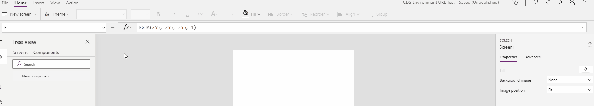
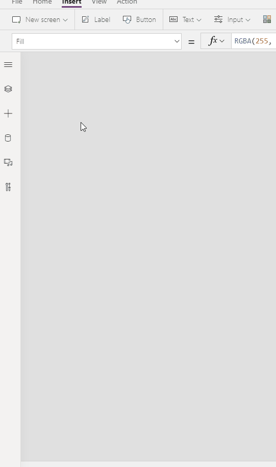
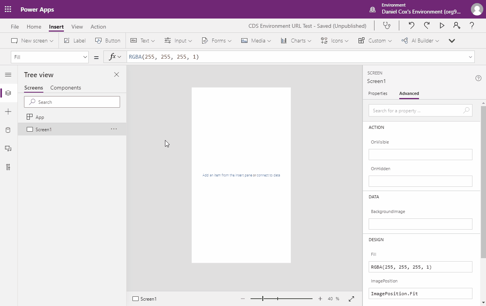

# CDSEnvironmentURL

This is a very simple control that allows you to get the URL for the app's CDS environment inside of a canvas app. You can then use this URL in a variety of ways. For exmaple, you could create links back to the entity's form for the given record. 

## Requirements

In order to use use the CDS Environment URL, there are 2 main requirements:

1. You must use a CDS data source in your app. Without your app having a connection to the CDS enviroment, they'll be no access to the CDS environment from which this component can retrieve the environment's URL. 

2. In addition to having a CDS data source in your app, the app must actually connect to the CDS environment. Retrieving data from CDS is the easiest way to establish this connection. 

## Installation / Usage

* Make sure you have enabled PCF control for Canvas apps in your environment.  For instructions on that [Click Here](https://docs.microsoft.com/en-us/powerapps/developer/component-framework/component-framework-for-canvas-apps)
 
* In the Power Apps Editor navigate **Custom -> Import Components**

 
* On the Import Component screen select the **Code** tab and Import the **PowerAppsDev CDS Environment URL**

 
* Open the **Code components** area in the Insert panel and add the **PowerAppsDev CDS Environment URL** component to the form.  

 
* Click on the Component on the form and set the Properties for the component.

Use the cdsEnvironmentUrl property on the CDSEnvironmentUrl control to access the URL for your CDS environment. 

## Example

Here's an example of setting the _cdsEnvironmentUrl_ property to a variable named _url_ and using it on a test label.

